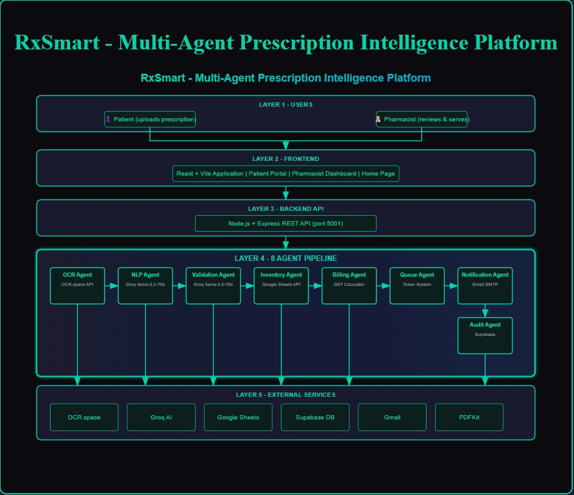

# 💊 RxSmart

*AI-powered prescription intelligence platform transforming pharmacy operations*

**AI-Powered** | **Multi-Agent** | **Real-Time** | **Paperless**

RxSmart is a multi-agent prescription intelligence platform that automates pharmacy operations through an Agent AI pipeline. The system processes prescription images and text, validates medicines, manages inventory, generates bills, and notifies patients - reducing processing time. 

## 🏗️ Architecture Overview




Each agent processes data sequentially, passing structured output to the next agent with comprehensive error handling and rollback mechanisms.

## ⚙️ Concept Coverage

| Concept | Implementation | File |
|---|---|---|
| Multi-Agent System | 8 sequential agents with structured handoff | prescription.js |
| Agentic Framework | Central orchestration with agentLog tracking | prescription.js |
| Guardrails | Drug interaction validation using Groq AI | validationAgent.js |
| Observability | Timestamped agentLog for every agent execution | prescription.js |
| RAG | Real-time medicine data from Google Sheets | inventoryAgent.js |
| MCP | Google Sheets as external context provider | inventoryAgent.js |

## 🧰 Tech Stack

| Layer | Technology | Purpose |
|---|---|---|
| Frontend | React + Vite + React Router v6 | UI and routing |
| Backend | Node.js + Express (ES Modules) | API server |
| AI / NLP | Groq llama-3.3-70b | Prescription parsing and validation |
| OCR | OCR.space API | Extract text from prescription images |
| Database | Supabase (PostgreSQL) | Data persistence and auth |
| Inventory | Google Sheets API | Real-time stock and pricing |
| Email | Nodemailer + Gmail SMTP | Patient notifications |
| PDF | PDFKit | Bill generation |
| Testing | Jest | Unit tests |

## 🚀 Setup Instructions

### Backend Setup
```bash
cd backend
npm install
```

Create `backend/.env` with these variables:
```env
PORT=5001
GEMINI_API_KEY=your_gemini_api_key
GROQ_API_KEY=your_groq_api_key
OCR_SPACE_API_KEY=your_ocr_space_api_key
SUPABASE_URL=your_supabase_url
SUPABASE_ANON_KEY=your_supabase_anon_key
GMAIL_USER=your_gmail@gmail.com
GMAIL_APP_PASSWORD=your_gmail_app_password
GOOGLE_SHEET_ID=your_google_sheet_id
GOOGLE_SERVICE_ACCOUNT_JSON=./credentials/service-account.json
```

###  Frontend Setup
```bash
cd frontend
npm install
```

###  Supabase Setup
- Create Supabase project
- Run migration: `node add_columns.js`
- Create `prescriptions` and `users` tables
- Configure authentication and RLS policies

###  Google Sheets Setup
- Enable Google Sheets API in Google Cloud Console
- Create service account credentials
- Share inventory spreadsheet with service account email
- Place credentials file in `backend/credentials/`

###  Run Application
```bash
# Backend
cd backend
node server.js
# Runs on http://localhost:5001

# Frontend
cd frontend
npm run dev
# Runs on http://localhost:5173
```

## 👤 How to Use


### Login Credentials

#### Patient Login
- **Email**: `patient@rxsmart.com`
- **Password**: `patient123`

#### Pharmacist Login  
- **Email**: `pharmacists@rxsmart.com`
- **Password**: `pharma123`


### Patient Flow
1. **Sign up/Login**: Create account or login to patient portal
2. **Upload Prescription**: Upload image or type prescription text
3. **Processing**: 8-agent pipeline processes automatically
4. **View Status**: Check prescription status and bill details
5. **Receive Notification**: Get email when medicines are ready
6. **Collect**: Visit pharmacy with token number

### Pharmacist Flow
1. **Login**: Access pharmacist dashboard
2. **View Queue**: Monitor patient queue and prescriptions
3. **Review**: Check processed prescriptions for accuracy
4. **Mark Served**: Update status to trigger patient notifications
5. **Manage**: View daily statistics and analytics

## 📁 Folder Structure

```
rxsmart/
├── backend/
│   ├── agents/              # 8 AI agent implementations
│   │   ├── ocrAgent.js
│   │   ├── nlpAgent.js
│   │   ├── validationAgent.js
│   │   ├── inventoryAgent.js
│   │   ├── billingAgent.js
│   │   ├── queueAgent.js
│   │   ├── notificationAgent.js
│   │   └── auditAgent.js
│   ├── routes/              # API route handlers
│   │   ├── prescription.js  # Main processing pipeline
│   │   ├── auth.js
│   │   ├── billing.js
│   │   ├── queue.js
│   │   └── setup.js
│   ├── lib/                 # Database clients
│   │   └── supabaseClient.js
│   ├── middleware/          # Auth middleware
│   ├── tests/               # Unit tests
│   ├── uploads/             # File uploads
│   ├── credentials/         # API credentials
│   ├── server.js            # Express server
│   └── package.json
├── frontend/
│   ├── src/
│   │   ├── pages/           # React page components
│   │   ├── components/      # Reusable components
│   │   ├── context/         # React context
│   │   ├── styles/          # CSS files
│   │   └── utils/           # Utilities
│   ├── public/
│   ├── index.html
│   ├── vite.config.js
│   └── package.json
├── add_columns.sql          # Database schema
├── startup.mjs              # Development script
└── README.md
```

## 🔌 API Endpoints

| Method | Endpoint | Description |
|---|---|---|
| POST | /api/prescription/process | Upload and process prescription image |
| POST | /api/prescription/process-text | Process text prescription |
| GET | /api/prescription/queue | Get current queue |
| PATCH | /api/prescription/:id/mark-served | Mark prescription served |
| GET | /api/prescription/patient-history | Get patient history |
| POST | /api/auth/signup | Patient registration |
| POST | /api/auth/login | User login |

## 🧪 Testing

### How to Run Tests
```bash
cd backend
npx --node-options="--experimental-vm-modules" jest
```

### What Is Tested
| Test File | Coverage |
|---|---|
| billingAgent.test.js | Bill generation and GST calculations |
| nlpAgent.test.js | Text parsing and medicine extraction |
| ocrAgent.test.js | Image text extraction |
| validationAgent.test.js | Drug interaction checks |

All tests use Jest with ES Modules support via `jest.config.cjs`.
